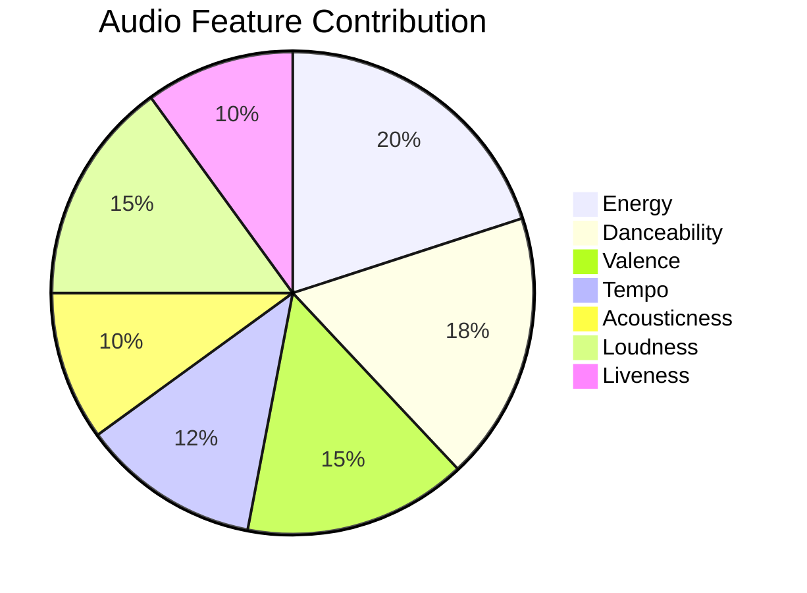
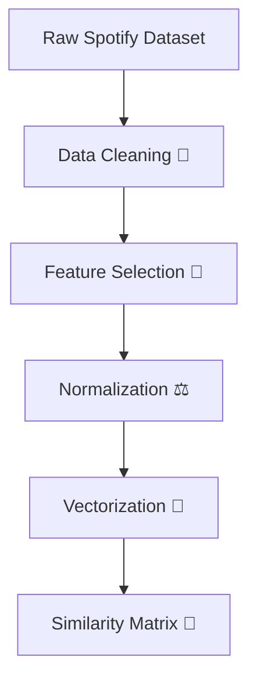
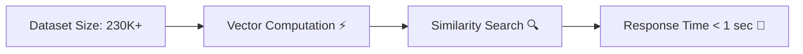

# 🎧 AI Music Recommendation System  
### *Next-Gen Content-Based Recommender Engine*

A **high-performance Music Recommendation System** that combines a **scalable Machine Learning backend** with a **premium React frontend**, enabling intelligent, real-time music discovery.

---

## ✨ Core Highlights

- 🚀 **Ultra-Fast Recommendations**  
  Processes **230,000+ Spotify tracks** in milliseconds using optimized vector operations.

- 🧠 **Content-Based Filtering**  
  Uses **Cosine Similarity** on multi-dimensional audio features:
  - Energy
  - Valence
  - Danceability
  - Tempo
  - Acousticness
  - Loudness
  - Liveness

- 🎯 **Genre-Aware Recommendations**  
  Weighted genre encoding improves accuracy and personalization.

- 🎶 **Live Audio Preview System**
  - Integrated with **iTunes Search API**
  - Streams **30-sec MP3 previews**
  - Fully dynamic (no storage needed)

- 🎨 **Premium UI**
  - Dark Mode 🌙
  - Glassmorphism ✨
  - Smooth Animations
  - Fully Responsive

---

## 🛠️ Tech Stack

### ⚙️ Backend (AI Engine)
- Python
- Pandas & NumPy
- Scikit-Learn
- Flask & Flask-CORS

### 🎨 Frontend (UI)
- React 18 + Vite
- TypeScript
- Tailwind CSS
- Lucide React

---

## 📊 System Architecture (Flow Diagram)


---

## 📈 Dataset Insights (Visualization)

### 🎵 Feature Importance Representation



---

### 📊 Data Processing Pipeline



---

## 📚 Dataset

- **SpotifyFeatures.csv**
- Size: ~33MB  
- Tracks: **232,000+ songs**

### 🔍 Sample Data Format

```csv
track_name,artist,genre,energy,valence,danceability,tempo
Shape of You,Ed Sheeran,pop,0.65,0.93,0.82,96
Believer,Imagine Dragons,rock,0.78,0.67,0.74,125
Blinding Lights,The Weeknd,synthwave,0.73,0.86,0.51,171
```

---

## 🎯 Recommendation Example Output

```text
Input Song: Shape of You - Ed Sheeran

Top Recommendations:
1. Blinding Lights - The Weeknd
2. Dance Monkey - Tones and I
3. Senorita - Shawn Mendes & Camila Cabello
4. Stay - Justin Bieber
5. Levitating - Dua Lipa
```

---

## 🧩 Key Concept

> “Songs are recommended based on similarity in musical DNA, not popularity.”

---

## ⚡ Performance Snapshot



---

## 🚀 How to Run Locally

### 🟢 Easy Way (Windows)
1. Clone the repository  
2. Double-click `run.bat`  
3. Wait 5–10 seconds  
4. Open: http://localhost:5173  

---

### 🔵 Manual Setup

#### 1️⃣ Start Backend
```bash
cd Backend
python api.py
```

Runs on: `http://127.0.0.1:5000`

---

#### 2️⃣ Start Frontend
```bash
cd Frontend
npm install
npm run dev
```

Runs on: `http://localhost:5173`

---

## 📌 Future Enhancements

- 🔥 Hybrid Recommendation (Content + Collaborative)
- ❤️ User Preference Learning
- 📱 Mobile App Integration
- ☁️ Cloud Deployment (AWS / GCP)
- 🎯 Real-time Personalization

---

## 👨‍💻 Developed For

**Recommender Systems (RS) Mini Project**